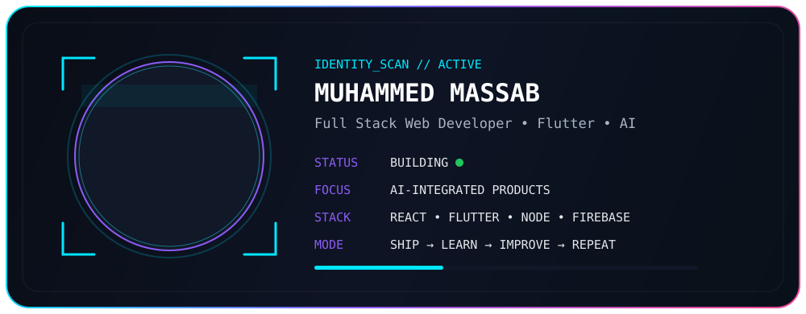
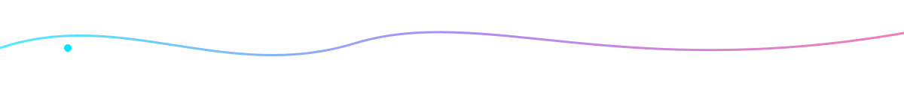

<div align="center">



<br/>

<a href="https://github.com/khanking0316120">
  
</a>
<a href="https://www.linkedin.com/in/muhammad-massab-891208300/">
  
</a>
<a href="mailto:mohammadmassab75@gmail.com">
  
</a>

<br/><br/>


</div>

---

<div align="center">
  
</div>

## `> whoami`

```js
const massab = {
  name: "Muhammed Massab",
  location: "Pakistan 🇵🇰",
  roles: [
    "Full Stack Web Developer",
    "Flutter Developer",
    "AI Automation Builder"
  ],
  currentFocus: "AI-integrated mobile & web applications",
  learning: "Advanced full-stack architecture + AI automation workflows",
  mindset: "Build useful products. Keep the UX clean. Keep shipping."
};
```

### ⚡ Right now

- 🔭 Building **AI-integrated mobile applications** and modern full-stack products.
- 🌱 Learning **advanced full-stack architectures** and **new AI automation workflows**.
- 👯 Open to collaborating on **full-stack apps, AI automation tools, and open-source Flutter projects**.
- 🤝 Interested in stronger **backend architecture, scalability, and AI-powered application design**.
- 💬 Ask me about **React.js, Node.js, C#, SQL, Flutter, Dart, Firebase, MongoDB, and AI automation**.
- 📫 Reach me at **mohammadmassab75@gmail.com**.

---

## ⚙️ Tech Arsenal

<div align="center">


</div>

<br/>

<div align="center">


</div>

---

## 📊 GitHub Command Center

<div align="center">


<br/><br/>


<br/><br/>


</div>

---

## 🧠 Developer Mode

<div align="center">

| `Frontend` | `Mobile` | `Backend` | `Data / Cloud` | `Workflow` |
|---|---|---|---|---|
| React.js | Flutter | Node.js | Firebase | Git / GitHub |
| JavaScript | Dart | C# / .NET | MongoDB | VS Code |
| HTML / CSS | Android | REST APIs | MySQL / SQL | Android Studio |
| Tailwind CSS | Responsive UI | App Architecture | Authentication | AI-assisted Dev |

</div>

---

## 🟣 Contribution Snake

<div align="center">

<picture>
  <source media="(prefers-color-scheme: dark)" srcset="https://raw.githubusercontent.com/khanking0316120/khanking0316120/output/github-contribution-grid-snake-dark.svg">
  <source media="(prefers-color-scheme: light)" srcset="https://raw.githubusercontent.com/khanking0316120/khanking0316120/output/github-contribution-grid-snake.svg">
  
</picture>

</div>

---

## 🤝 Let's Build Something Cool

<div align="center">

**Full-stack web apps • Flutter products • AI automations • Open source**

<br/>

<a href="mailto:mohammadmassab75@gmail.com">
  
</a>

<a href="https://www.linkedin.com/in/muhammad-massab-891208300/">
  
</a>

<br/><br/>



<sub>Built with code, caffeine, curiosity and a slightly unreasonable love for clean UI.</sub>

</div>
